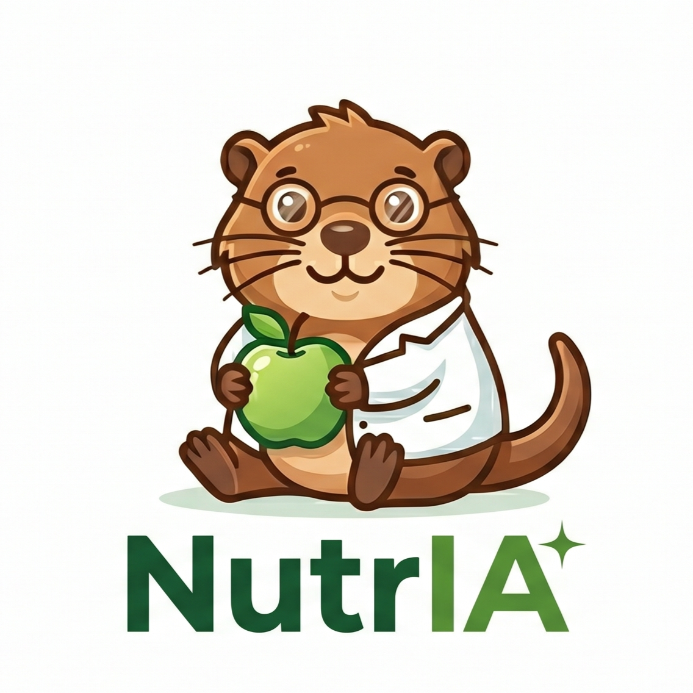
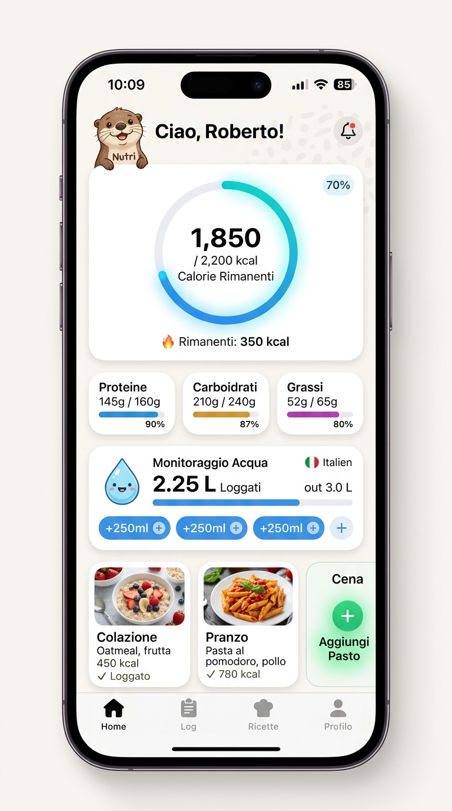
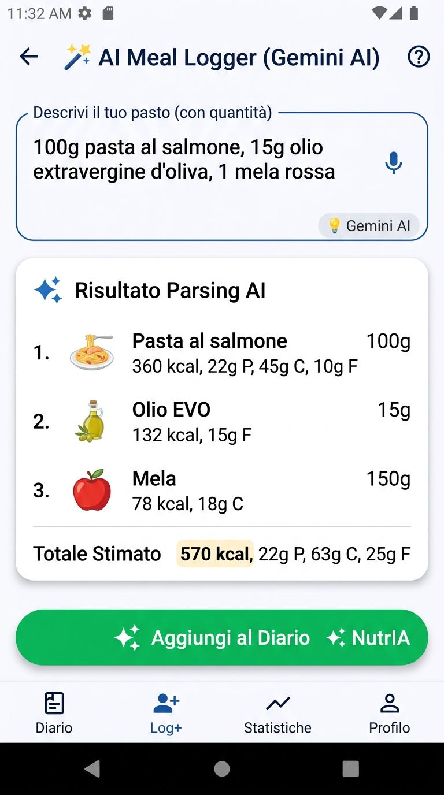
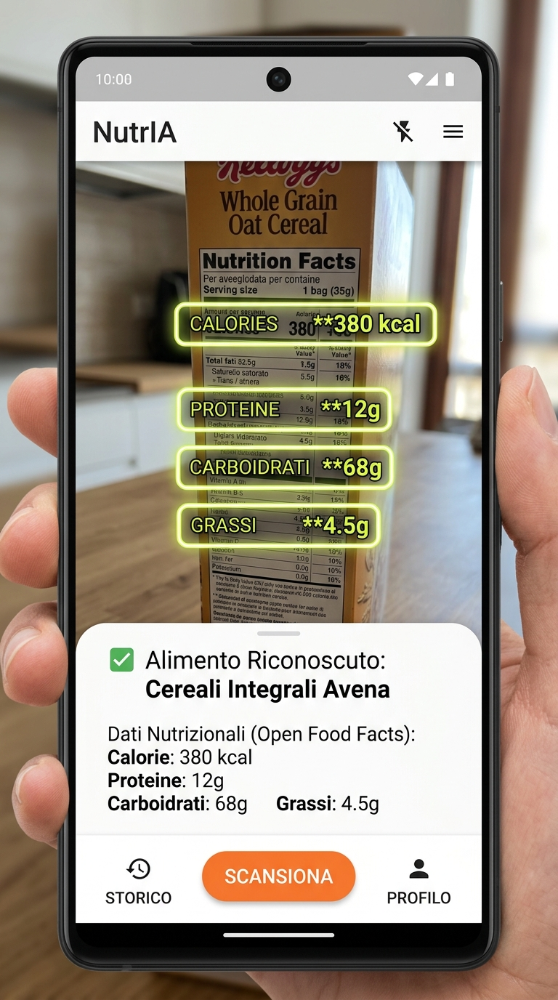

<div align="center">

  

  # NutrIA 🦦🥗
  ### *Il Diario Nutrizionale Intelligente potenziato dall'Intelligenza Artificiale*

  [](https://flutter.dev)
  [](https://dart.dev)
  [](https://ai.google.dev)
  [](https://isar.dev)
  [](LICENSE)

  <p align="center">
    <b>Traccia calorie, macronutrienti e pasti in pochi secondi grazie all'IA.</b><br>
    NutrIA unisce la precisione del tracking manuale alla velocità dell'Intelligenza Artificiale (Google Gemini): descrivi un pasto a voce, scatta una foto al piatto o inquadra la tabella nutrizionale per registrare tutto all'istante.
  </p>

</div>

---

## 📱 Screenshots dell'Applicazione

<div align="center">
  <table>
    <tr>
      <td align="center" width="33%">
        <b>📊 Dashboard Nutrizionale</b><br><br>
        <br><br>
        <em>Ring calorie giornaliere, barre macronutrienti (P/C/F), water tracker e pasti suddivisi.</em>
      </td>
      <td align="center" width="33%">
        <b>🪄 AI Meal Logger (Gemini)</b><br><br>
        <br><br>
        <em>Riconoscimento ingredienti da testo o voce con calcolo immediato di porzioni e grammature.</em>
      </td>
      <td align="center" width="33%">
        <b>📷 Scanner OCR & Barcode</b><br><br>
        <br><br>
        <em>Scansione tabelle nutrizionali con realtà aumentata e integrazione Open Food Facts.</em>
      </td>
    </tr>
  </table>
</div>

---

## 🌟 Funzionalità Principali

### 🪄 1. AI Meal Logger Multimodale (Testo, Foto e Voce)
* **Stima Intelligente del Piatto:** Inserisci descrizioni testuali libere (*es. "100g pasta al salmone, 15g olio EVO e una mela"*) o scatta una foto al piatto. Gemini AI calcolerà automaticamente ingredienti, grammature e valori nutrizionali.
* **Modalità "Intera Giornata":** Ditta o scrivi l'intera giornata in una frase (*es. "Colazione con fette biscottate e marmellata, a pranzo 80g di riso e pollo"*). L'IA distribuisce automaticamente i cibi nei pasti corretti (Colazione, Pranzo, Cena, Snack).
* **Dettatura Vocale Integrata:** Microfono incorporato per registrare gli alimenti al volo senza digitare.

### 🔍 2. Scanner Avanzato di Alimenti & OCR Tabelle
* **Scanner Tabella Nutrizionale (OCR):** Inquadra la tabella nutrizionale sul retro di qualsiasi confezione. L'IA estrae all'istante calorie, proteine, carboidrati, grassi e fibre per 100g.
* **Lettore Barcode EAN:** Scansiona il codice a barre del prodotto per interrogare in tempo reale il database globale di **Open Food Facts**.

### 📊 3. Dashboard e Monitoraggio Quotidiano
* **Monitoraggio Macro in Tempo Reale:** Calcolo dinamico di calorie rimanenti e target per Proteine, Carboidrati, Grassi e Fibre.
* **Water Tracker Integrato:** Registrazione rapida dell'assunzione di acqua con chip veloci (+250ml, +500ml).
* **Regola 80/20 (Cheat Days):** Modalità avanzata per escludere i giorni sgarro non tracciati dal calcolo delle medie settimanali.
* **Mini-Calendario Storico:** Navigazione rapida tra i giorni passati per consultare o modificare il diario.

### 🍎 4. Libreria Alimenti Personale & Database Online
* **Alimenti Salvati & Preferiti:** Modifica rapida di nome, marca e macronutrienti con storico personalizzato.
* **Ricerca Web Open Food Facts:** Accesso istantaneo a milioni di prodotti alimentari verificati.
* **Creazione Alimenti Manuale:** Form semplificato per creare cibi custom con calcolo automatico kcal da grammature.

---

## 🛠️ Stack Tecnologico

* **Framework:** [Flutter](https://flutter.dev) (Dart `>= 3.11.4`)
* **Local Database:** [Isar Database](https://isar.dev) (database NoSQL ad altissime prestazioni per Flutter)
* **Intelligenza Artificiale:** [Google Generative AI SDK](https://pub.dev/packages/google_generative_ai) (Gemini 2.0 Flash / Pro)
* **Database Alimenti:** [Open Food Facts API](https://world.openfoodfacts.org)
* **State Management:** [Provider](https://pub.dev/packages/provider)
* **Integrazioni Native:** `QuickActions` per scorciatoie su icona app e `MethodChannel` per widget di sistema.

---

## 🚀 Come Eseguire il Progetto

### Prerequisiti
* [Flutter SDK](https://flutter.dev/docs/get-started/install) (versione `>= 3.11.4`)
* [Google AI Studio API Key](https://aistudio.google.com/) per abilitare le funzionalità di Gemini AI.

### Installazione

1. **Clona la repository:**
   ```bash
   git clone https://github.com/RobFalc99/NutrIA.git
   cd NutrIA
   ```

2. **Installa le dipendenze:**
   ```bash
   flutter pub get
   ```

3. **Configura la chiave API di Gemini:**
   Inserisci la tua chiave `GEMINI_API_KEY` nelle impostazioni dell'app o nel file di configurazione ambiente.

4. **Avvia l'applicazione:**
   ```bash
   flutter run
   ```

---

## 📄 Licenza

Distribuito sotto licenza **MIT**. Consulta il file `LICENSE` per maggiori informazioni.

---

<div align="center">
  Sviluppato con dedizione per la salute e il benessere da <b>Roberto Falcone</b> 🦦🍏
</div>
